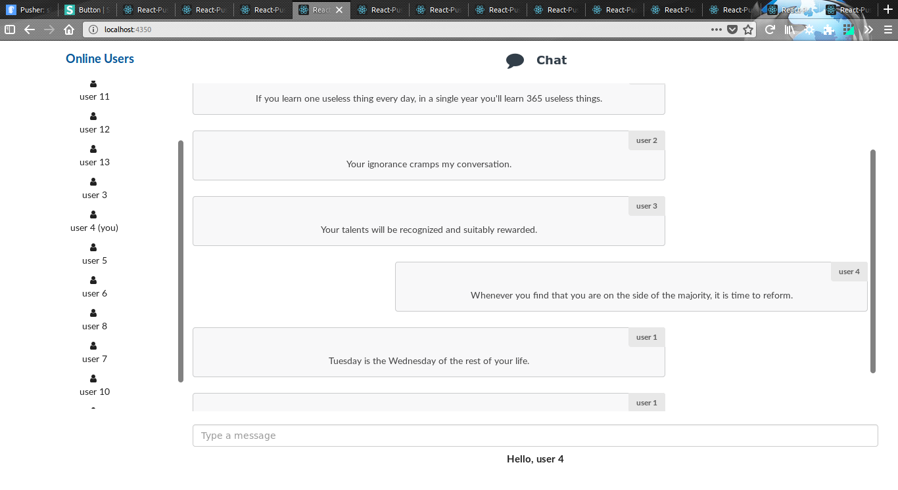

To run app:

- Download/Clone repository
- run npm install
- start server with `node server.js`
- start react app with `npm start`

- Webhook is used to update online users. Add webhook in pusher app settings. To use webhook with local server install ngrok. See [docs](https://ngrok.com/docs).

